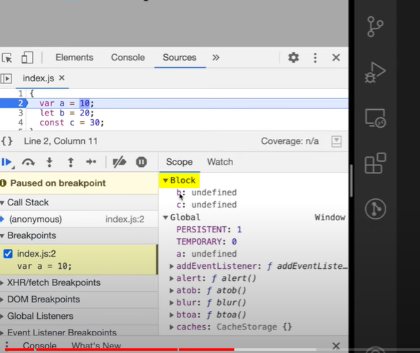
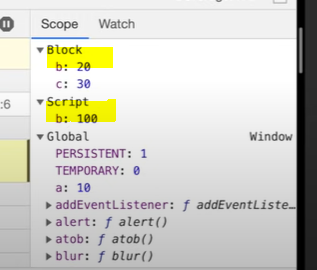
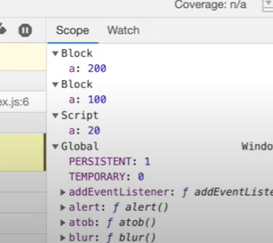
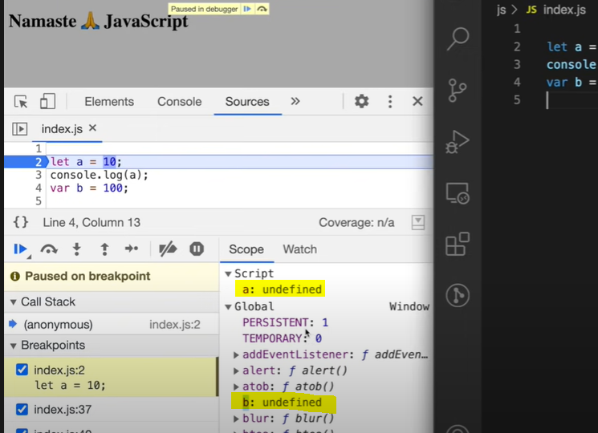
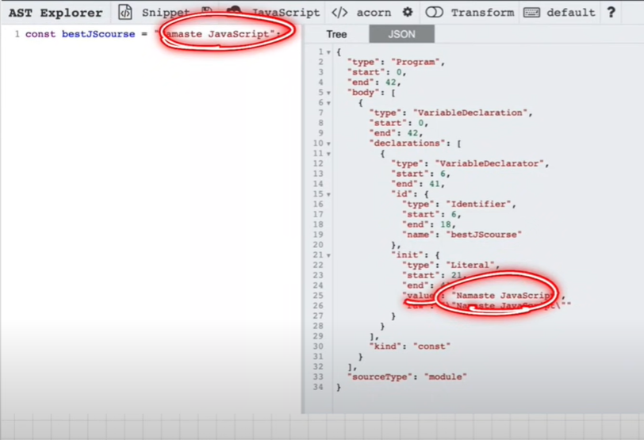
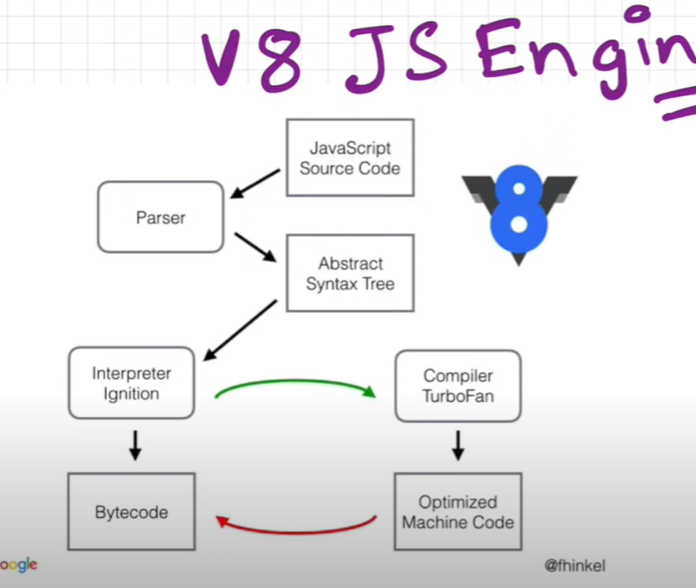
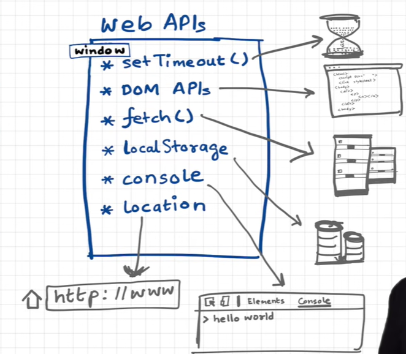

### How JS works?
> execution context 
Everything in JS happens inside the execution context (container inside where entire JS function is executed)

components of execution context:

1. memory / variable environment- variables / functions stored as key value pairs (environemt in which all variables and functions are stored as the execution context)
2. Code component / thread of execution - All the code is executed inside this component. 
```bash 
all logic inside the function will be executed in the code component 
```
### JS is a synchronous, single threaded language 
- single-threaded - execute one command at a time 
- synchronous, single threaded - execute one command at a time in a particular sequence. 

### What happens when you run a JS program 
> an execution context is created 


When you run a JS program, a global execution cotext is created. 

> execution context is created in 2 phases 
1. memory creation phase - allocate memory to all variables and functions 
even before you run the program, JS skims through your program and allocated initial memory values, which is later updated.
```bash 
# JS goes through the code line by line to allocate memory to variables and functions
var n = 2;
# allocated a special value undefined to n in memory
function square(num){
    var ans = num * num
    return ans 
}
# the entire function code of square is stored inside the memory 

var square2 = square(n)
# allocates undefined to square2
var square4 = square(4)
# allocates undefined to square4
```
2. code execution phase 
```bash 
# JS runs though code line by line and creates logic for the code 
var n = 2;
# n is replaced from undefined to 2 
function square(num){ //num is parameter 
    var ans = num * num
    return ans 
}

var square2 = square(n) //n is argument 
# a new execution context is created for executing the square function
var square4 = square(4)
```
> execution context for the square2 variable which runs the square function 
```bash 
function square(num) { 
    var ans = num * num
    return ans 
}
```
> initially, while allocating initial memory 
```bash 
memory         |     code 
num: undefined |  
ans: undefined |
```
> after, when code component is executed 
```bash 
memory         |    code 
num: 2         |    num x num (2x2)
# after logic calculations, ans will be updated 
ans: 4
```
> when pointer reaches return ans 
```bash 
function square(num) { 
    var ans = num * num
    # return ans means return execution context control back to the place where function was invoked and square2 variable will be replaced from undefined to 4 
    # this execution context will be deleted 
    return ans 
}
```
> Similary an execution context for the square4 variable which runs the square function will be created, initially both values will be undefined, when the code component is executed, its assigned value from the program 
```bash 
memory      |    code 
num: 4      |    num x num 
# after logic calculations, ans will be updated 
ans: 16
```
after assigning the updated to the memory (square4: undefined), this execution context will be deleted.


> After program is executed, the whole Global execution context is deleted. 

### JS manages multiple execution contexts, one inside the other through Call stack
> Call stack - contains a Global execution context 
```bash
Whenever JS program is run, call stack is populated with execution context of the program 
# when exection context is created its pushed inside the stack 
# when execution context is deleted its pushed outside the stack 
# when program is executed, the call stack GEC is destroyed 
```
### Call stack 
call stack maintains the order of execution of execution contexts. 

> other names for call stack 


### Block vs Functional scope 
1. block / compound statement - group of multiple statements embedded in cuurly braces and is used where JS expects a single statement. 
```bash 
if(true {
        var a= 10 
        console.log(a)
        }
```
> Block scope - what variables and functions you can access inside this block. 
```bash 
{
    var a= 10 
    let b=20
    const c=30
}
```


> b and c are stored in seperate memory space which is reserved for the block. you cannot access let and const outside of this block scope.
```bash 
{
    let b = 100
}
console.log(b)

console:
reference error: b is not defined.
```
### What is shadowing?
#### Shadowing in var 
```bash 
var a = 100
{
    # this var a shadows the global value of a 
    # its overwritten because it points to the same memory location
    var a = 10 
    console.log(a)
}

console:
10
```
> another example,
```bash 
var a = 100
{
    var a = 10 
}
console.log(a)

console:
10
```
#### Shadowing in let 
```bash 
# this b has script scope 
let b = 100 
{
    var a = 10 
    # this b has block scope
    # this b is shadowing the top b value 
    let b = 20
    const c = 30 
    console.log(a)
    console.log(b)
    console.log(c)
}
console.log(b)

console:
10
20
30
100
```


#### Shadowing in const 
> similar to let 
```bash 
# this b has script scope 
const b = 100 
{
    # this b has block scope
    # this b is shadowing the top b value 
    const b = 20
    console.log(b)

}
console.log(b)

console:
20
100
```
#### What is illegal shadowing?
```bash 
# you cant shadow let using a var 
# also in the same scope let cannot be redeclared with another let 
let a = 20 
{
    var a = 20
    # aint possible 
}
```
> this is legal because `var a` is inside function scope
```bash 
    <script>
        let a = 20 
        function x() {
            var a = 10
            console.log(a)
        }
        
        x()
    </script>

console:
10
```
> you can shadow var using a let 
```bash 
var a = 20 
{
    let a = 20
    # this is legal 
}
```
> you can shadow const using a const 
```bash 
        const a = 20 
        {
            const a = 10
            console.log(a)
        }
    </script>

console:
10
```
> Every block has its own scope 
```bash 
const a = 20 
{
    const a = 100 
    {
        const a = 200
        console.log(a)
    }
}

console:
200
```


### Scope chain 
```bash 
function a(){
    console.log(b)
}
var b = 10 
a()

console:
10
```
> another example, 
```bash 
function a(){
    function c(){
        console.log(b)
    }
}

var b = 10
a()

console:
10
```
### Scope 
> Scope - space where you can access a specific variable / function in code. **scope is directly dependent on the lexical environent**
```bash 
function a(){
    var b= 10 
    c()
    function c(){
      console.log(b)
    }
}
a()

console:
10
```
> What happens behind the hood?
- before running the program, JS skims though the code and assigns a value
```bash 
memory   |   code 
a:{...}  |   // creating execution context for a 
             memory        |    code 
             b: undefined  |
             c: {...}
          
```
- execution GEC is created and pushed onto call stack (Lexical environment is created whenever execution context is created )
```bash 
memory   |   code
#  also contains lexical environment of global scope's parent which points to null  
a:{...}  |   // creating execution context for a 
             memory        |    code 
             b: 10         |
             c: {...}
             #  also contains ref to lexical environment of its parent `global scope `
               //creating execution context for c 
                memory     |   code 
                b: 
                # contains reference to lexical environment of its parent `a` 
          
```
#### Whenever an execution context is created a lexical environemnt is also created. 
`Lexical environment = local memory + lexical environment of immediate parent `
> Chain of lexical environment is called scope chain. 

### Scope chain 
> The process of finding the variable from lexical scope is called scope chain. `chain of lexical environment`
- first it tries to find `b` inside c() local scope, it doesnt 
- however, c() contains a reference of its parent a()
- then it tries to find b in a() local scope, it finds and assigns value of b to it. 

### Hoisting 
Phenomena where you can access variables and functions even before you have initialized it.

```bash 
x shows undefined because it was not given a value, when we console logged it, it was only assigned a value later on in the code 

    <script>
        getName()
        // we are trying to access x even before we have initialized it
        # we know that intiially when js skims through our code, it initialises undefined to our variables 
        console.log(x)

        var x = 7
        function getName() {
            console.log('namaste js')
        }
    </script>

console:
undefined 
namaste js
```

> the intiial mememory allocation of the normal function is the function itself and not undefined 
```bash 
    <script>
        console.log(getName)
        console.log(x)

        var x = 7
       function getName(){
            console.log('namaste js')
        }
    </script>

console:
ƒ getName(){
            console.log('namaste js')
        }

VM95 index.html:12 undefined
```
- when we define an arrow function instead of a normal function
```bash 
    <script>
        getName()
        console.log(x)

       var x = 7
       var getName =() =>{
            console.log('namaste js')
        }
    </script>

console:
index.html:11 Uncaught TypeError: getName is not a function
at index.html:11:9

# the reason were getting this error is because over here getName() is acting like how a variable acts on memory allocation 
# initially memory allocated to variables is undefined, similarly, arrow function getName() also gets the undefined value initially; thats why its showing the error message getName is not a function
```
> arrow function getName() acts like a variable 
```bash 
    <script>
        # getName acts like a variable in the memory
        # thats why it prints undefined becausse initially js skims through the program before assigning a value 
        # it assigns undefined value to getName and x
        # when it runs through the code it hasnt yet encountered the defination of these values since its consoled before its assigned a value 
        console.log(getName)
        console.log(x)

       var x = 7
       var getName = () => {
            console.log('namaste js')
        }
    </script>

console:
undefined
undefined
```
- when we define a function in this format 
```bash 
    <script>
        getName()
        console.log(x)

        var x = 7
        # getName over here acts just like a variable 
       var getName = function() {
            console.log('namaste js')
        }
    </script>

console:
index.html:11 Uncaught TypeError: getName is not a function
at index.html:11:9
```

> How is `undefined` different from `not defined`?

```bash 
    <script>
       console.log(x)
       function getName(){
            console.log('namaste js')
        }
    </script>
console:
Uncaught ReferenceError: x is not defined
# reference X is not defined means that x was no where to be found in the memory 
```
- undefined essentially means the value is declared (var x) not defined (var x = something)
- after we write our program and before exection i.e before we run it, JS skims through our program and assigns an initial value to the variables and functions which is undefined.  


- not defined means we have not even declared (var x) the variable and were trying to console it. 
- so when JS skims through our program and it finds no variable as x in this case, it assigns no value to that particular variable, because it doesnt even exist in the codebase to start with.

### let & const declarations are hoisted 
- but they are in the temporal dead zone 

> an example of both var and let together. both var and let are allocated memory. but let is stored in a seperate memory space. 
```bash 
    <script>
        console.log(b)
        # we dont get error we get a special placeholder called undefined 

        console.log(a)
        # gives error, cannot access a before initialisation
        let a = 10
        var b = 100
    </script>
```


### Temporal dead zone 
time from where let variable is hoisted and its assigned a value in the memory. 

> To understand this, lets first look into a situation where hoisting does not take place 
```bash 
# before JS is executed, it skims through the code and assigns a value to each variable, initially it assigns undefined to a 
# after its run, memory for a replaces undefined with 10
let a = 10 
console.log(a)
var b = 100
```
> Here is an example with hoisting 
```bash 
console.log(a)   
# a is assigned a memory space with value undefined 
✅Temporal dead zone ends here, all code lines before this are TDZ of a 

let a = 10  //its assigned a value here 
var b = 100

console:
Reference error: cannot access a before intiialization
# whenever you try to access a variable inside a TDZ it gives a reference error 
```
> Whats the difference between let and var behavior in this code?
```bash 
let a = 10 
console.log(a)
# a is attached to another storage space specific for let and const
var b = 100 
# b is attached to the window object, the global space  

console:
# when you type window.b 
100
# when you type window.a
undefined 
```
> you cannot redeclare `let`
```bash 
console.log('meow')
let a = 10
let a = 100

console:
syntaxerror: identifier 'a' has already been declared 
```
#### const 
acts just like let in terms of TDZ. 
```bash
# you cannot initialize and declare on seperate lines in const, can only be acheived in let and var 
const b;
b = 100;

console:
typeerror: assignment to constant variable 
```
### Types of Errors 
1. syntax error 
> missing initializer syntax error 
```bash 
const b;

console:
syntax error: missing initializer in const declaration
```
> duplicate declaration syntax error 
```bash 
let a = 10 
let a = 100 

console.log(a)

console:
syntaxerror: identifier 'a' has already been declared 
```
1. type error - your assigning value to const variable on declaration line which is not possible.
```bash 
const b;
b = 100;

console:
typeerror: assignment to constant variable 
```
3. reference error - when your trying to access a variable from the TDZ, it throws a reference error 
> cannot access before intialisation error 
```bash 
let a = 1000
console.log(a)

console:
reference error: cannot access a before intialization
```
> not defined error 
```bash 
console.log(y)
# were consoling a variable we havent declared yet 

console:
reference error: y is not defined 
```
### which one to use: let / var / const ?
1. const - ensures your value doesnt change later on in code 
2. let - straight up throws error, so its easy for us to pin point what could be solved, also we cannot redeclare it, which makes it a safer option from security POV.
3. var - not recommended to use 

### How to avoid Temporal dead zone?
- shrink the temporal dead zone window to 0. 
Always put declarations and initialisations on top of the code, otherwise you will run into alot of errors. 

#### How function invokation behaves behind the scenes?
```bash 
    <script>
        var x = 1
        a()
        b()
        console.log('first x',x)

       function a(){
           var x = 10
           console.log('a',x)
       }

       function b(){
        // use same variable name over here 
        var x = 100
        console.log('b',x)
       }
    </script>

console:
a 10
index.html:24 b 100
index.html:14 first x 1
```
> When you run a JS program, a global execution cotext is created.
execution context is created in 2 phases: memory creation phase and code execution phase 

1. memory creation phase 
initially these memeory are allocated to these variables and function
```bash 
# memory space is AKA variable environment
memory                    |     code 
x:undefined
a: {} store function code 
b: {} store function code 
```
> this GEC is pushed onto the call stack. 

2. code execution phase 
```bash 
memory    |    code 
x=1       |    when pointer encounters var x = 1 
a: {...}  |    creates another execution context for its function 
               memory    |    code 
               x:10      |    initially it was undefined, after running its 10
               # after completing execution, a is updated to 10 now, it returns the control to the main code 
b: {...}  |    creates another execution context for its function 
               memory    |    code 
               x:10      |    initially it was undefined, after running its 10
               # after completing execution, a is updated to 10 now, it returns the control to the main code 
```
### JS Engine runtime environment 
> Js is a synchronous single threaded language.
```bash 
First JS engine developed was by Brendan Eich (created Js) while he was working in netscape.
```
Browser can execute JS code because it has JS run time environment. 

> constituents of JS runtime environment:
- JS engine - contains the call stack 
```bash 
all JS code is executed inside the call stack 
```
- API's to connect to outer environment 
- event loop 
- callback queue
- microtask queue 

eg: `Node.js` is a JS runtime environment, which can run JS outside the browser.  Js engine that `Node.js` uses is V8.

> Different browsers have different JS runtime environment. 
```bash 
browser       |       JS runtime engine 
Edge          |       chakra
Firefox       |       spider monkey 
chrome        |       Googles V8 engine 
```
> What happens in JS engine?
- takes code as input and there are 3 levels its passed to each one in synchronous order
1. Parsing - code broken down into tokens 
```bash 
`syntax parser`
syntax parser takes code and converts it to AST (abstract syntax tree)
```


2. Compilation 
```bash 
Just in time compilation - JS engines use intrepretor + compiler 

JS can behave as an intrepretor and compiler language because most Js engines uses compiler and intrepretor. 
```
JIT ensures that it can optimize the code as much as it can in the run time environment through `AOT - Ahead of time complexity`  and returns `byte code` to the execution phase.

> Is js intrepreted or compiler language?
```bash 
# intrepetor vs compiler
Intrepretor:
- executes code line by line
- code is fast 

Compiler:
- code is compiled and optimized version of code is formed and then it is executed 
- code is more efficient, but not as fast as intrepretor 
```
3. execution 
byte code is executed using the memory heap and the callstack 

- memory heap (all memory stored here)
```bash 
- garbage collector (frees up memory space whenever variable is not in use / expired) through Mark and sweep algorithm (optimization technique)
```
> There are many optimization techniques in JS engine 
```bash 
1.Mark and Sweep
2.Inling
3.Copy Elision
4.Inline Caching
```
- call stack. 
Whenever JS program is run global executoion context is created which is pushed inside call stack.

#### How Google V8 engine works?
```bash 
Google V8 engine.
- intrepretor name: Ignition
- compiler name: turbo fan 
```


### Call stack 
```bash 
function a(){
    console.log('a')
}

a()
console.log('end')
```
> under the hood 
```bash 
memory    |    code 
# gec is pushed into the callstack 
a()       |    execution context created 
               # a is pushed inside the call stack   
               memory   |   code 
               clg(a)   | 
               # after printing the console statemnet this execution context is destroyed 
               # a() is then popped out from the callstack 

clg(end)  |    after printing this on console, the GEC is popped out
```
> Browser contains:
- JS run time environment, JS runtime environment contains JS engine, js engine contains call stack (executes the JS program)
- local storage 
- timer 
- URL 
- viewport - where view will be rendered 

Everything in call stack is immediately executed, to create delays in execution time we need web API's  


#### Browser gives JS engine the ability to access to web API's through the window (global object) 
The window object wraps up all the web API's in one container and when the call stack wants to access any of these web API's we can invoke via (window.setTimeout / window.fetch() etc...) in our code.

However, we dont need to mention window object, since its a `global object`, we can access it without the `window` keyword.

> Lets analyze what happens behind the hood in this program.
```bash 
console.log('start')

setTimeout(function cb(){
   console.log('callback')
}, 5000)

console.log('end')
```
> Demo of how the Web API and call stack work together.
```bash 
memory   |   code 
clg(a)   |   call the console API and it makes a call 
             console API is linked to this callstack via window object 
cb()     |   setTimeout function will call the setTimeout api via window object
             However since its a cb it will register setTimeout with a 5000 time delay 
             after 5s it will be stacked inside callback queue
             event loop checks if there is anything inside the callback queue 
             and pushes into the call stack
            # call stack creates an execution context for this cb()
            memory        |     code 
            clg(callback) |     callstack calls the consoleAPI via the window object

clg(end) |  call the console API and it makes a call 
```
#### Another example 
```bash 
console.log('start')

document.getElementById('btn')
.addEventListener('click', function cb(){
    console.log('callback')
})

console.log('end')
```
1. Whenever we run a JS code GEC is created and pushed onto call stack.
```bash 
memory          |   code
clg('start')    |   callstack consoles it by calling the console API via the window object 
addEventListener|   calstack adds an event listener through the DOM API which is present inside the window object 
                    Register the callback (attaching the click functionality) in the web APIs environment 
                    when a user clicks on the event listener, callback is pushed inside the callback queue 

clg('end')      |   callstack consoles end by calling the console API 
```
Now start and end is printed on the console and their execution contexts is popped from the callstack 
- callback is registered in the callback queue and the event loop checks if 
1. callstack is empty 
2. if callback queue has a callback present in it 

if it has a cb in the callback queue, it pushes inside the callstack.

```bash 
console.log('start')

setTimeout(function cbT() {
    console.log('cb setTimeout')
}, 5000)

fetch('url')
.then(function cbF() {
    console.log('cb netflix')
})

console.log('end')
```
> behind the scenes:
1. When the code is run, a GEC is created.
2. JS goes through line by line and assigns memory to each line of code
```bash 
memory         |    code 
clg(start)     |    callstack calls the consoleAPI and prints start on console 
cbT()          |    setTimeout API is called and callback is registered onto the Web API environeemnt
                    # after timer of 5000 ended its added to the callback queue 
cbF()          |    fetch API is called and callback is registered onto the web API environment 
                    # after data is fetched from the server its added to the microtask queue
clg(end)       |    callstack calls the consoleAPI and prints end on console 
```
> Functions inside microtask queue is executed first and functions inside callback queue executes second 
Event Loop continuosly monitors the call stack and checks if its empty (if all the synchronous tasks are executed and popped off). It also checks if there are any pending tasks to be executed inside the microtask queue and the callback queue. 
- tasks inside microtask queue is added to the call stack first and then its popped off from the call stack after execution
- tasks inside callback queue is added to the call stack after all contents from microtask queue is popped off. after execution even this callback is popped off. 

#### Microtask Queue contains 
- contains all the callback functions that comes through `promises`.
- `Mutation observers` (checks whether there is mutation in the DOM tree or not) - if there is mutation in the DOM tree execute callback function.

#### Callback Queue contains 
- contains callback functions from setTimeout(), DOM API's
- CALLBACK QUEUE AKA `TASK QUEUE`

### Starvation of the callback queue 
When the microstask queue has unlimited tasks, tasks inside the callback queue will never get a chance to be executed, this leads to starvation of the callback queue.


