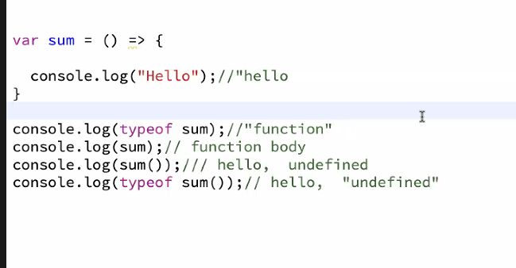

### Functions 
- functions can recieve and input/ argument and functions can give an output.

function is a block of code 
- makes code cleaner 
- improves reusibility of the code 
- saves development time 

function should be created ina  way that it should implement a single task. for eg: instead of adding addition and subtraction logic in one function we can create seperate functions for both of them 

> How to create function 
1. function declaration 
```bash 
# parameter
function sum(num1, num2){
    return num1 + num2
}
console.log(sum(4,5))
# argument - value passed to the function
```
2. function expression
```bash 
var sum = function(num1, num2){
    return num1 + num2
}
console.log(sum(4,5))
# the rhs part is a function without a name, its an anonymous function and we assign it to the variable 
```
> after ES6 arrow functions were introduced 
3. (function expression using arrow notation)
```bash 
var subtract = (num1, num2) => {
    return num1 - num2 
}
console.log(subtract(4,5))
```
> another example 
```bash 
var sum = () => {
    console.log('hello')
}
```
> Why different kinds of function ?
- There are certain functions where we dont need to specify a specific name (anonymous function) callback function


### Scope of variable in JS 
- var has functional scope 
- let and const have block level scope 

> lexical scope 
if a variable is not present in its execution context it will keep checking in its parent's execution context until it reaches the global execution context.
```bash
var x = 10 
# were invoking the function after defining the value 
main()

function main(){
    console.log(x)
}

console:
10
```
> another example,
```bash 
var x = 10 
main()

function main(){
    console.log(x)  //10
    var y = 20
    sub()
}

function sub(){
    console.log(x)  //10
    console.log(y)  //20
}

console:
10
10
20
```
> how does it work under the hood ?
There are essentially 3 scopes it will search for in this order.
- GEC 
- OUTER SCOPE 
- INNER SCOPE 

when main() is called and it encounters clg(x) lexical scope first tries to find it in its current execution context `inner scope`, when it fails to find it there, it tries to find it in outer scope it doesnt find it there, then it searches in the `global execution context`.

when sub() is called and it encounters x, it tries to find in its current execution context `inner scope` when it fails to find it tries to find it in `outer scope`, it finds the value of y here.
```bash 
✅Global execution context
memory      |   code 
x:10        |  intiially x=undefined,after it encounters the first line 
            ✅Outer scope 
               memory    |   code 
               x:10      |   intiially undefined, later 10
               y:20
               # after execution it destroys the inner execution context and saves value in GEC 
               ✅Inner scope 
                  memory  |  code 
                  x:10    | initially undefined, later 10 
                  y:20    | 
                  # after execution it destroys this inner execution context, then GEC is destroyed from the call stack 
```
### Closures
The inner child function has access to the scope of the outer/parent function even when the outer function is already executed. 
```bash
function outer(){
    var firstname = 'reem'

    var inner = () => {
        console.log(firstname)
    }
}
outer()              //nothiing printed 
console.log(outer()) //when you dont return anything it prints undefined 
```
> another example,
```bash 
function outer(){
    var firstname = 'reem'

    var inner = () => {
        console.log(firstname)
    }
    return inner 
}

var abcd = outer()             
console.log(abcd)
# returns function body of inner 

abcd() 
# when we invoke the function body, it prints reem 
```
> lets discuss some questions:
```bash 
function main(){
    var counter = 0 

    var increase = () => {
        counter++
    }
    var decrease = () => {
        counter--
    }
    var display = ()=> {
        console.log(`${counter}`)
    }
    return {
        increase: increase,
        decrease: decrease,
        display: display
    }
}

var data = main()
console.log(data) //returns an object of functions 
```
> Q1. 
```bash 
<script>
for (var index=0; index<10; index++){
      console.log(index)  //0-9
}
console.log(index)        //10
</script>
```
> Q2.
```bash 
for (var index=0; index<10; index++){
    # this entire loop runs till 9, the moment it reaches 10, it doesnt fulfill the condition 
    # settimeout function is in the callback array intially 
    # by the time our loop reaches 10, our setimeout will be ready to execute 
    setTimeout(() => {
      console.log(index)
    }, 1000)
}

console:
10 times 10 
```
> Q3. 
```bash 
    <script>
  for (let index=0; index<10; index++){
    setTimeout(() => {
      console.log(index)
    }, 1000)
  }  
    </script>

console:
0-9
```


