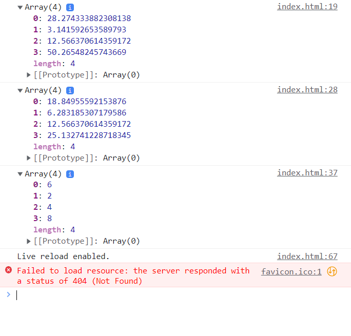
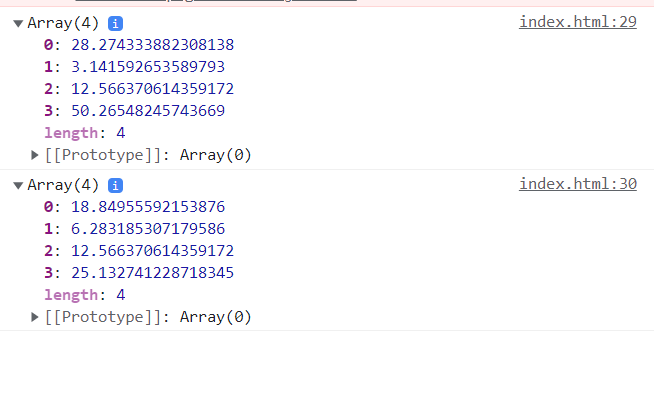
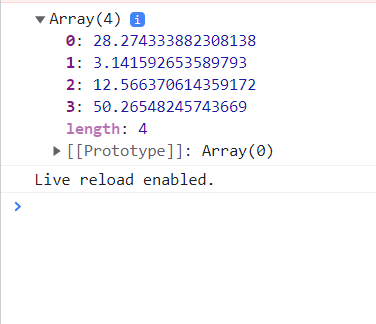
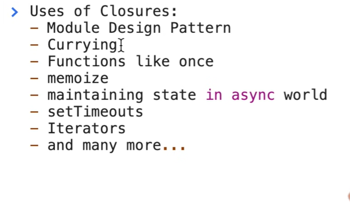

### Higher Order Functions 
Function which takes another function as an argumnet or returns a function from it. 
```bash 
function x(){
    console.log('namaste')
}

# y is the higher order function here 
function y(x){
  x()
}
```
> an example, 
```bash 
const radius = [3, 1, 2, 4]
const calculateArea = function (radius) {
    const output = [];
    # iterate through the radius
    for(let i=0; i<radius.length; i++){
        output.push(Math.PI * radius[i] * radius[i])
    }
    return output
}
console.log(calculateArea(radius))

const calculateCircum = function (radius) {
    const output = [];
    # iterate through the radius
    for(let i=0; i<radius.length; i++){
        output.push(2 * Math.PI * radius[i])
    }
    return output 
}
console.log(calculateCircum(radius))

const calculateDiameter = function(radius){
    const output = [];
    for(let i=0; i<radius.length; i++){
        output.push(2 * radius[i])
    }
    return output 
}
console.log(calculateDiameter(radius))
```


#### Functional Programming 
Logic is broken down into small reusable components.

> How to minimize this code through `DRY` principle.
```bash 
const radius = [3, 1, 2, 4]

# we have abstracted code into smaller functions
# 1. area function snippet 
const area = function (radius) {
    return Math.PI * radius * radius 
}

# 2. circumference function snippet 
const circumference = function(radius){
    return 2 * Math.PI * radius
}

# were taking function as an argument 
# the function thats passed to the higher order function is a callback function  
const calculate = function (radius, logic) {
    const output = []
    for(let i=0; i<radius.length; i++){
        output.push(logic(radius[i]))
    }
    # returns function 
    return output
}

# we can calculate both the area and circumference of the circle through a common function calculate instead of writting the for loop over again 
console.log(calculate(radius, area))
console.log(calculate(radius, circumference))
```


### Basically your code should implement these functionalities:
- pure functions 
- reusability
- modularity 
- how you thought through the logic 

> we can even use map function in place of `calculate(area)`
```bash 
  <script>
        const radius = [3, 1, 2, 4]

        const area = function (radius) {
            return Math.PI * radius * radius 
        }
        # maps the whole radius array, iterates over every element and implements the area functionality on each element
        console.log(radius.map(area))
    </script>
```


> instead of writing map, lets write a polyfill 
```bash 
<script>
    const radius = [3, 1, 2, 4]

    const area = function (radius) {
    return Math.PI * radius * radius 
    }

    # this is a polyphill for map 
    Array.prototype.calculate = function (logic) {
    const output = []
    for(let i=0; i<this.length; i++){
        output.push(logic(this[i]))
    }
    return output
    }

    console.log(radius.calculate(area))
</script>
```


> examples of higher order function: map, filter, reduce 

### map function 
used to transform an array 
```bash 
const arr = [5, 1, 3, 2, 6]

# this is transformational logic
function double(x){
    return x*2
}

const output = arr.map(double)

console:
[10, 2, 6, 4, 12]
```
### filter function 
used to filter out elements from the array 
```bash 
const arr = [5, 1, 3, 4, 6]
# taking array as input and filtering elements based on logic

# filter odd elements from the array
function isOdd(x){
    return x % 2 != 0
}
const output = arr.filter(isOdd)
console.log(output)

console:
[5, 1, 3]
```
### reduce function 
Take elements of an array and find out a particular value. that can be max or sum etc. 

> Q1. find the sum of all the elements in an array 
To acheive this in the basic B way, we would do this
```bash 
const arr = [5, 1, 3, 2, 6]

function findSum(arr){
    let sum=0
    for(let i=0; i<arr.length; i++){
        sum = sum + arr[i]
    }
    return sum 
}
console.log(findSum(arr))

console:
17
```
> However, we can acheive the same using reduce function
```bash
const arr = [5, 1, 3, 2, 6]

# reduce function takes 2 arguments 
# first arg is the anonymous function 
# second arg is the inital value your passing to your acc 
const output = arr.reduce(function(acc, curr) {
    # reduce iterates over each element of array 
    # curr - represent values in the array 
    # acc - used to accumulate the result of the values  
    acc = acc + curr

    # curr is equavalent to arr[i] from the above code 
    # acc is equavalent to sum from the above code 
    return acc 
}, 0)
console.log(output)
```
> Q2. find the max value in an array using reduce()
```bash 
const arr = [5, 1, 3, 2, 6]

function findMax(arr) {
    let max = 0
    for(let i=0; i<arr.length; i++)
    {
        if(arr[i] > max) {
            max = arr[i]
        }
    }
    return max
}
console.log(findMax(arr))
```
> acheive the same output using reducer function 
```bash 
const arr = [5, 1, 3, 2, 6]

# this function called against each value of the array 
const output = arr.reduce(function(acc, curr) {
    if(curr > acc){
        acc = curr
    }
    return acc
    # acc is same as max over here 
}, 0)

console.log(output)
```
### Closures (function + lexical scope)
function bundled together with its lexical scope. 
```bash 
function x() {
    var a = 7
    function y(){
        console.log(a)
    }
    y()
}
x()

console:
7
```
#### Lets take an example to understand closures better
> you can return function y() like this 
```bash 
  function x() {
    var a = 7;
    # y remembers its lexical scope 
    function y() {
          console.log(a);
        }
        return y;
        # when we return y it returns function + closure + lexical scope is returned 
      }
    var z = x();
    console.log(z)
    z()

console:
ƒ y() {
          console.log(a);
        }

index.html:21 7
```
> or like this 
```bash 
  function x() {
    var a = 7;
    return function y() {
          console.log(a);
        }
        # when we return y it returns function + closure + lexical scope is returned 
      }
    var z = x();
    console.log(z)
    z()

console:
ƒ y() {
          console.log(a);
        }

index.html:21 7
```
#### Another example of closure
```bash 
  function x() {
    var a = 7;
    function y() {
          console.log(a);
        }
        a=100
        # a is overwritten through redeclaration
        # function remembers reference of a's memory location 
        return y
      }
    var z = x();
    console.log(z)
    z()

console:
ƒ y() {
          console.log(a);
        }

index.html:21 100
```
> another example,
```bash 
function z(){
    var b = 900
    function x(){
        var a = 7
        function y(){
            console.log(a,b)
        }
        y()
        # y() forms a closure along with scope of x() [parent] and scope of z() [parent's parent]
    }
    x()
}
z()
```

- function currying 
- higher order function - memoize 
- setTimeouts 
- Iterator 
- module design pattern 
- data hiding and encapsulation 

#### Interview Questions 
> Q1. Whats the output?
```bash 
function x(){
    var i = 1
    setTimeout(function(){
        console.log(i)
    }, 1000)
    console.log('meow')
}
x()

console:
meow
# after 1s print 1 
```
> Q2. Print 6 at an interval of these seconds (1s, 2s, 3s, 4s, 5s) using `var`
```bash 
 function x(){
     for(var i=1; i<=5; i++){
         setTimeout(function() {
             console.log(i)
             # copy of i belong to same memory location
         }, i*1000)
        #  i=1 1s
        #  i=2 2s
        #  i=3 3s
        #  i=4 4s
        #  i=5 5s 
     }
     console.log('meow')
 }
 x()

console:
meow 
6
6
6
6
6
6
```
> Q3. Print 1,2,3,4,5 at an interval of these seconds (1s, 2s, 3s, 4s, 5s) using `let`
```bash 
 function x(){
    # let is block scoped 
    # a new copy of the variable i forms a closure with the setTimeout function 
     for(let i=1; i<=5; i++){
         setTimeout(function() { 
             console.log(i)
            #  creates 5 copies of variable i 
         }, i*1000)
        #  i=1 1s
        #  i=2 2s
        #  i=3 3s
        #  i=4 4s
        #  i=5 5s 
     }
     console.log('meow')
 }
 x()

 console:
 meow 
 1
 2
 3
 4
 5
```
> Q3. Print 1,2,3,4,5 at an interval of these seconds (1s, 2s, 3s, 4s, 5s) using `var`
```bash 
 function x(){
     for(var i=1; i<=5; i++){
        # wrapping setTimeout inside close()
        # creates a new copy of i everytime this function is run 
        ✅function close(i){
         setTimeout(function() {
             console.log(i)
         }, i*1000)
        }
        ✅close(i)
     }
    console.log('meow')
 }
# a new copy of x() is created everytime close function is called with a new value of i 
x()

console:
meow 
1
2
3
4
5
```
> Q4. what is closure?
Function with reference to its outer environemnt together forms a closure. closure is combination of function + lexica scope bundled together. 

> Q5. use of double paranthesis in closure
Every function in JS has access to it outer lexical environment 
```bash 
function outer(){
    var a = 10
    # inner() has access to outer() environment 
    function inner(){
        console.log(a)
    }
    # inner() + lexical outer environment (outer()) = closure 
    return inner 
}
# ✅var close = outer()  #first line executes the inner function 
# console.log(close)

# ✅close()              #this line executes the outer function
# these 2 lines are same as outer()()

console:
# ƒ inner(){
#         console.log(a)
#     }
```
> Q6. what is we pass a parameter through the outer scope 
```bash 
function outer(b){
    # inner() forms a closure with the outer() environment 
    function inner(){
        console.log(a, b)
    }
    let a = 10
    return inner 
}

var close = outer('hello world')
close()
# outer('hello world')()

console:
10
hello world 
```
> Q3. Relation of closure chain and closure. 3 level nested closures 
```bash 
function outest(){
    var c = 20
    function outer(b){
        # inner() forms a closure with the outer() environment 
        function inner(){
            console.log(a, b, c)
        }
        let a = 10
        return inner 
    }
    return outer 
}
var outest = outest()
var outer = outest('hello')
var close = outer()

console:
10 hello 20
```
> Q4. How data hiding and encapsulation works
data hiding / data privacy - encapsulate data so other parts of the program cannot access it. 
```bash
function counter(){
    var count = 0

    function increementCounter(){
        counter++
    }
}
console.log(count)
# you cannot access count from outside the scope 

console:
RefrenceError: count is not defined 
```
> however if we want to access it.
```bash 
function counter(){
    # were hidding this data through data hiding 
    var count = 0

    return function increementCounter(){
        counter++
    }
}
 var counter1 = counter()
 counter1()

# when were calling this function more than one times it increements from the previous value 
 counter1()

 console:
 1 
 2
```
> Q5. Add a deecrement function and make it scalable 
```bash 
function Counter(){
    var count = 0 
    this.increementCounter = function(){
        count++
        console.log(count)
    }
        
    this.decreementCounter = function(){
    count--
    console.log(count)
    }
}
# constructor function uses new keyword 
var counter1 = new Counter()
counter1.increementCounter()
```
> Q6. Disadvantages of closure:
- overconsumption of memory becase everytime closure formed it takes alot of memory space, and those variables are not garbage collected. If its not handled properly, it can lead to memory leaks.

`garbage collector is a program in the JS engine which frees up the variables which are unused - frees up the memory.`

> Q7. Relation in between closures and garbage collector.
```bash 
function a(){
    var x = 0 
    # function b forms closure with function a 
    return function b(){
        console.log(x)
    }
}
a()
# once execution of a is over, x is garbage collected
```
### Call, apply and bind in JS 
```bash 
let name = {
    firstname: 'Akshay',
    lastname: 'Saini',
}

let printFullName = function(hometown, state){
    console.log(this.firstname + this.lastname + hometown + state)
}

printFullName.call(name, 'dehradun', 'uttarkhand')

let name2 = {
    firstname: 'Akshay',
    lastname: 'Saini',   
}

# function borrowing 
# using call method, we can do function borrowing 
# take the function that needs to be called 
printFullName.call(name2, 'mumbai', 'maharashtra')

# in apply method you pass values in an array list 
printFullName.apply(name2, ['mumbai', 'maharashtra'])

# bind method 
# bind and keep copy of the method so that we can use it later 
let printMyName = printFullName.bind(name2, 'mumbai', 'maharashtra')c
console.log(printMyName)
printMyName()

console:
# call
2index.html:17 AkshaySainidehradunuttarkhand
# apply
2index.html:17 AkshaySainimumbaimaharashtra
# console printMyName through bind 
index.html:31 ƒ (hometown, state){
    console.log(this.firstname + this.lastname + hometown + state)
}
# binds the copy of the same method that can be invoked later 
index.html:17 AkshaySainimumbaimaharashtra
```
### Currying 
> using bind method 
```bash 
let multiply = function (x, y){
    console.log(x*y)
}

# bind method will return a copy of the multiply method 
let multiplyByTwo = multiply.bind(this, 2)
#`this` in this context refers to x 
multiplyByTwo(5)

console:
10
```
> using closure method 
```bash 
let multiply = function(x){
    return function (y){
        console.log(x*y)
    }
}

let multiplyByTwo = multiply(2)
multiplyByTwo(3)

console:
6
```
### REST vs SPREAD operator 
> REST operator 
```bash 
# the problem 
function addNumbers(a, b){
    return a+b
}
# it doesnt log all these values 
addNumbers(2,4,5,6,7)

# the solution: REST operator 
function addNumbers(a, b, ...n){
    return a+b
}
# it doesnt log all these values 
addNumbers(2,4,5,6,7)
```
> SPREAD operator 
```bash 
function logNames(name1, name2, name3){
    console.log(name1, name2, name3)
}

var names = ['shoaib', 'zaid', 'tushar']
# instead of seperately calling each element of this array 
# we can access it like this 
logNames(...names)
```
### memoization 
technique which returns value from cache, if its already been computed before.
```bash
const addition = (a,b) => {
    return a+b
}

# generate a unique key - so we can store values with the unique keys 
const propNameFromArg = (fnToAddition, args) => {
   let propKey = []
   propKey = propKey.concat(fnToAddition.name, args)
   return propKey.join('|')
    # ['addition'|10|20] 
}

# decide whether to call the function (logic) or return a function from the cache 
# higher order function - func passing parameter to another function
const memoize = (fnToAddition) => {
    const memoCache = {}
    # we'll construct key in this way 
    # {'addition|10|20': 30}
    # if in the future it recieves a key with this format, it will directly return the value 30

    # return a function 
    return function(...args){
        const propName = propNameFromArg(fnToAddition, args)
        # if value is not present in the memocache then implement the function (logic)
        if(!memoCache[propName]) {
            # call the function `addition` and save it inside memorycache 
            memoCache[propName] = fnToAddition(...args)
            return memoCache[propName]
        } 
        # if value is present in the memory 
        else {
            console.log('from cache')
        }
        return memoCache[propName]
    }
}

const memoAddition = memoize(addition)

# the first time the user runs this it prints 30 
console.log(memoAddition(10,20))

# if user calls the same function again, we need to log it from cache instead of reclaculating it again 
console.log(memoAddition(10,20))

```
### Callback function
callback functions takes a function and passes an argument to another function
```bash 
# setTimeout also takes a callback function 
setTimeout(function(){
    console.log('timer')
}, 5000)

function x(y){
    console.log('x')
    y()
}
# function y called sometime later in code - callback function
x(function y(){
    console.log('y')
})

console:
x
y
# after 5ms is expired 
timer 
```
> What is main thread, main thread blocking? 
JS has one call stack which is called as main thread. 
If any operation blocks the call stack, it will be `blocking the main thread`

### Callback with closure + eventListener
```bash 
    <script>
      function attachEvent(){ 
        let count = 0 
        # attached event handler to the button 
          document.getElementById('clickme').addEventListener('click', function xyz(){
            # callback function is forming closurre with its outer scope 
            console.log('btn clicked', ++count)
          })
      }
    </script>

console:
when you click on count it increements the variable 
```
> event listeners are heavy, it makes page slower, because alot of uneccesary closures are consuming the memory. We need to  removeEventListener after they done executing, to acheive this, there is a concept called garbage collection.


