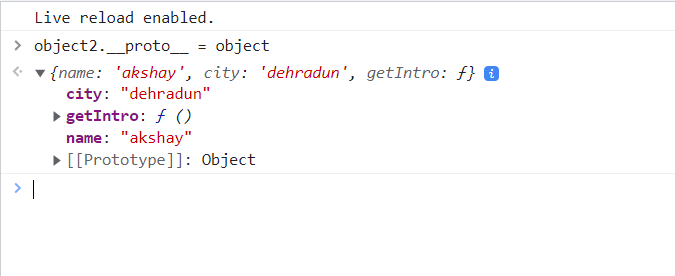

### Prototypal inheritance 
Inheritance is one object trying to access properties of another object. 
```bash 
let arr = ['akshay', 'akash']
# when we do arr. in console it shows a bunch of properties in console 

let object = {
    name: 'akshay',
    city: 'dehradun',
    getIntro: function(){
        console.log(this.name + this.city)
    }
}

function fun(){

}

# console:
object.name 
> akshay 
# js automatically attaches object with hidden properties and functions 
```
#### Prototype 
> prototype is an object which has properties and methods 

Prototype is an object attached to each and every method object / array / function. You can can access these properties by using the dot operator 

#### Prototype chain 
Whenever we create an array, it has a prototype `arr.__proto__` this is same as `Array.prototype` and the prototype of Array.prototype( i.e `arr.__proto__.__proto__`) is Object.prototype. 

#### Fetching the prototype of `arr` defined above 
> arr.__proto__ is same as Array.prototype
> arr.__proto__.__proto__ is same as Object.Prototype 
> arr.__proto__.__proto__.__proto__ is null 

#### Fetching the prototype of `fun` defined above 
> fun.__proto__ is same as Function.prototype
> fun.__proto__.__proto__ is same as Object.Prototype 
> fun.__proto__.__proto__.__proto__ is null 

### Object2 accessing methods and properties of Object1 via proto 
```bash 
    <script>
      let arr = ["akshay", "akash"];

      let object = {
        name: "akshay",
        city: "dehradun",
        getIntro: function () {
          console.log(this.name + this.city);
        },
      };

    # object2 inheriting properties from object 
      let object2 = {
        name: "reem",
      };
    </script>

console:
object1.city
> 'dehradun'

object2.getIntro()
> reemfrom dehradun 
```


### Creating custom prototype


### What is proto?
```bash 
var User = function(firstName, courseCount){
    this.firstName = firstName 
    this.courseCount = courseCount 
    this.getCourseCount = function(){
        console.log(`${this.courseCount}`)
    }
}
 
# Defining prototypes 
# when were creating objects and properties onto bigger scale projects, we need to define certain methods outside 
User.prototype.getFirstName = function(){
    console.log(`your first name is: ${this.firstName}`)
}

# why do we define prototypes when we can define directly inside the object?
# for large scale projects it can be a hastle 
# its accesability can be secured 

var hitesh = new User('hitesh', 2)
hitesh.getCourseCount()
# new keyword finds all prototypes defined and inject inside hitesh object 
hitesh.getFirstName()

console;
2
your first name is: hitesh 
```
> another example 

### Advantages of prototypes 
- no matter how many objects you create functions are loaded only once into the memory 
- allows you to override functions if required 
```bash 
let person  = {
  fName:'John', 
  lName:'Pillip',
  age: 23,
  getName: function(){
      return `${this.fName} ${this.lName}`
  },
  getAge: function(){
      return `${this.age} years`
  }
}

console.log(person.getName());
console.log(person.getAge());


# create an instance from the person object
let newPerson = Object.create(person);

# OVERRIDING METHOD USING PROTOTYPE 
# instead of a new property, let's add a function with the same name 
newPerson.getName = function(){
  return `${this.lName} ${this.fName}` 
}

console.log(newPerson.getName());
console.log(newPerson.getAge());

console:
"John Pillip"
"23 years"

"Pillip John"
"23 years"
```
### HTTP protocol 
> response- request cycle 

### CORS 
> protocol used to make the web secure 

Mechanism which uses additional HTTP headers to tell the browser whether a specific web app can share resource with another web app. 
> Both web apps must have different origins, if they have different origins they must follow the CORS mechanism. 

> Before resource sharing between different origins was not allowed.
```bash 
# for example,  http:akshaysaini.in could not share resource with 
different domain            google.com/api
subdomain                   api.akshaysaini.in 
different ports             akshaysaini.in:5050
different protocols         https:akshaysaini.in
```
#### How do 2 apps on different origins share resources then?

1. a CORS preflight OPTIONS call is made from (A->B)
2. B sends additional HTTP headers to A to verify this request is safe and valid 
```bash 
When call is made server sets up certain methods in the headers,

Most commonly used header methods.
- Accept-control-allow-originL http://akshaysaini.in
# this specifies which domain will have access to this particular server (B)
# when your trying to form a connection with another origin, you need to specify it inside the Aceept-control-allow-origin
```
3. actual call is made 


