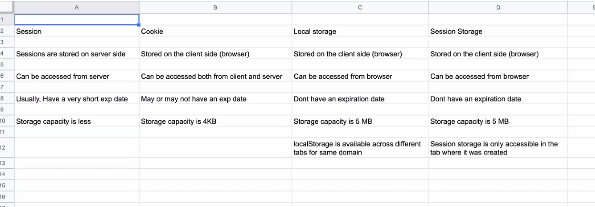
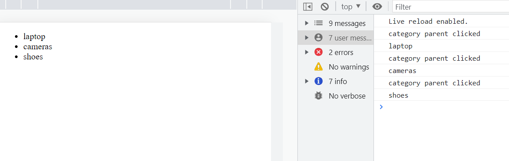

### Window object 
> Allows JS to interact with the browser.
```bash 
var x = 20 
# whenever we declare ay global variable it will always be a part of the window object

window.x 
# console:20

var myName = 'reem'
window.myName
# console:reem
```
> anything stored on the browser is stored on the window. window object contains these all properties.
- getParams 
- document (document is a part of the window object)document contains entire HTML for the page. 
- navigator 
- location 
- local storage 
```bash 
# example, to access properties of document object
window.document
# document contains HTML 
# html contains body 
```
> we can control the window using window methods. 

### BOM 
The BOM provides you with objects that expose the web browser’s functionality.
- BOM holds all the data present in the window object 
- Through BOM, we can make browser and DOM interact with each other 
```bash 
<body>
    <div id="app">hello</div>
<script>
    # through js were able to change the DOM
    document.getElementById('app').innerHTML = 'reem'
</script>
</body>
```

`BOM refers to Window objects in JavaScript`. Modern browsers have implemented the same methods and properties for JavaScript interactions, often referred to as BOM's methods and properties. A window object is automatically created by the browser

- Objects that make up the BOM include the window object, navigator object, screen object, history, location object, and the document object.

#### 1. Window
Window – understand the `window` object.
- Alert – display an alert dialog.
- Confirm – display a modal dialog with a question.
- Prompt – prompt the user to input some text.
- setTimeout – set a timer and execute a callback function once the timer expires.
- setInterval – execute a callback function repeatedly with a fixed delay between each call.
```bash 
window.alert('hello')
```
#### 2. Location
Location – manipulate the location of a document via the `location` object.
- Get query string parameters – learn how to retrieve query string parameters.
- Redirect to a new URL – show you how to redirect to a new URL using JavaScript.

#### 3. Navigator
Navigator – query the information and capabilities of the browser using the `navigator` object.
```bash 
window.navigator
# returns browser / os/ engine name

navigator.geolocation
# window.navigator.geolocation 
geolocation api is a part of the navigator object and navigator object is a part of the window object 
# geolocation api helps fetch your location, we can cheat it using a VPN 
```

#### 4. Screen
Screen – get the information about the screen on which the browser is running by using the `screen` object.

#### 5. History
History – manage the web browser’s history stack with the `history` object.
```bash 
# history object 
window.history 

# some methods 
window.back()
window.front()
```
### HTML web storage 
Used to store data in the browser. 


1. local storage 
> advantages:
- can store upto 5mb of data 
- have no expiration time. 
- Its not encrypted, so prevent storing passwords
```bash
# storing data to local storage 
localStorage.setItem('pass', 'dqiodq')
localstorage.getItem('pass')
``` 
> disadvantages:
- you cannot access it, in another device, it only exists in your browser only.
- any sensitive / heavy data should not be stored here 

2. session storage 
- stored on client side 
- can be accessed from browser 
- dont have expiration data 
- storage capacity is 5mb 
```bash
# storing data to local storage 
sessionStorage.setItem('pass', 'dqiodq')
sessionstorage.getItem('pass')
```
> difference between session storage and local storage?
```bash 
✅session storage is only accesable in the tab that it was created.
✅local storage is accesable across different tabs of the same website
```
> session and cookies work together 
3. session
Cookie, local storage and session storage are stored on the client side (browser), session is stored on the server.
- can only be accessed from the server 
```bash
# expiration time is usually less to prevent misuse of critical data 
- banking apps show your session is expired, do the transaction again 
```
4. cookies 
- can be accessed from client and server (its stored in browser, but even the server can access it)
- Cookies have expiration time 
- can store upto 4kb data. 

After you log into the website, a unique encrypted token is added to your browser when you say to save passwords or keep me logged in, if you log back in, browser will try to find that cookie to authenticate if your the right person trying to log into the account. 

> how do sessions and cookie work together?
```bash 
# when you log into a website, it asks for two factor authentication, they create a unique session for you and store it in the database, which keeps you logged in , it creates unique token for you, and sends it to the browser which is saved in the cookie on the browser side.
```
 ### Event Capturing and Event bubbling 
 > Event Capturing / Trickling 
 Process of identifying where an event has occured. 

 whenever any event happens on the webpage, page tries to identify, wherever the event has occured. It happens in **top down approach:**
 - document 
 - html
 - body
 - div 
 - button 
```bash 
<body id='mybody'>
    <div id="app">hello
        <button id="mybtn">click me</button>
    </div>
<script>
    # through js were able to change the DOM
    var myapp = document.getElementById('app')
    var mybody = document.getElementById('mybody')
    var mybtn = document.getElementById('mybtn')

    const handleClick = (e) => {
        console.log('document clicked')
    }

    const handlebutton = (e) => {
        console.log('button clicked')
    }

    const handleclickdiv = (e) => {
        console.log('div clicked')
    }

    document.addEventListener('click', handleClick)
    myapp.addEventListener('click', handleclickdiv)
    mybtn.addEventListener('click', handlebutton)
</script>
</body>

# when we click on the button
console:
# once it figures out event happened at button, it starts bubbling, then it checks for parent if they want result, and it checks for the parent's parent.
button clicked
div clicked
document clicked 
```
> Event Bubbling 
After finding the final target wherever the event occured, it starts spreading / bubbling in the DOM chain. **bottom-up approach** (button -> div -> document)

#### e.stopPropogation()
> If we want only the button to be clicked and we dont want it to go to its parent. We dont want it to get propogated to the parent
```bash 
<script>
    # through js were able to change the DOM
    var myapp = document.getElementById('app')
    var mybody = document.getElementById('mybody')
    var mybtn = document.getElementById('mybtn')

    const handleClick = (e) => {
        console.log('document clicked')
    }

    const handlebutton = (e) => {
        console.log('button clicked')
        e.stopPropogation()
    }

    const handleclickdiv = (e) => {
        console.log('div clicked')
    }

    document.addEventListener('click', handleClick)
    myapp.addEventListener('click', handleclickdiv)
    mybtn.addEventListener('click', handlebutton)
</script>

console:
button clicked
```
#### Is it good to have too many event listeners in the DOM?
when you register an event listener its stored in the callback queue and occupies uneccesary memory.

> if we have a very large DOM, and since it will check for every event that occured from `top-down approach`, this will occupy alot of memory and website will run very slow, its a costly operation. 

> How can we optimize the performance then?

### Event Delegation 
Delegating the event to the parent.

> real world example
On big applications like flipkart, there are many random events, basically alot of event handlers, now suppose you have infinite scrolling then the page would keep populating the DOM with child divs and keep attaching event handlers, this will cause alot of performance issues

- we resolve this, we use event delegation which attaches event handler to the parent of the child div, identify which div event occured and because of event bubbling, event will propogate from child to its parent 
```bash 
  <body>
    <div>
      <ul id="category">
        <li id="laptop">laptop</li>
        <li id="cameras">cameras</li>
        <li id="shoes">shoes</li>
      </ul>
    </div>
    <script>
        # event delegation 
        document.querySelector('#category').addEventListener('click', (e) => {
          # if we click into the category, callback function gets called 
          console.log('category parent clicked')

          # to figure out which li item is clicked we use the e.target property 
          console.log('target id',e.target.id)

          # when we click on the li item it returns the id and we can redirect to a new page which is specific to that id, for example flipkart.com/laptop
          if (e.target.tagName == 'li') { 
          window.location.href = '/' + e.target.id
          }
        })
    </script>
  </body>
```



