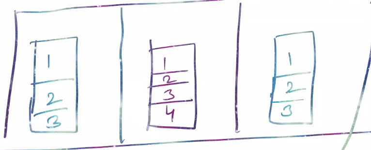
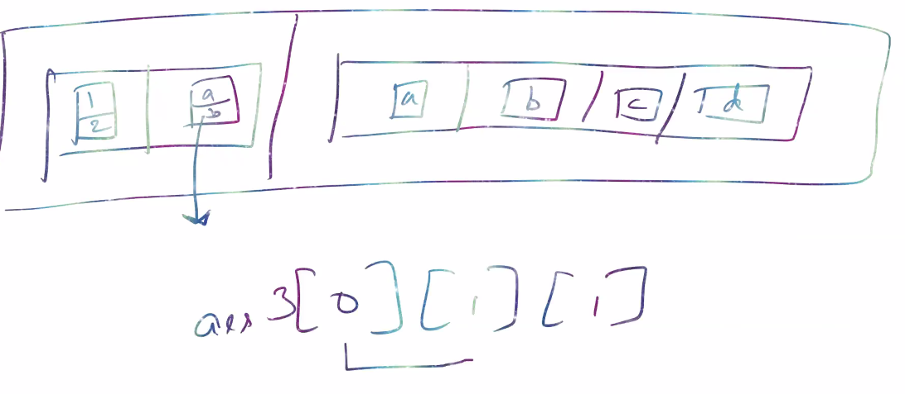

### Interview Questions 
> ES12 - ECMAScript2021 - current version 
What features introduced in ES12? 
```bash 
# underscores were allowed after ES12, to improve readability 
const num = 1234_1234_1234
# output: 123412341234
# underscores are not displayed at console. 
```
> When is the next ES13 release?
its in production, gonna release at September. 

1. Q. What is an array in JS? 
Array is a datastructure which stores the elements.  Arrays are an object in JS. 

In terms of DSA, Arrays are homogeneous, but technically in JS, arrays are heterogenous. 
- homogeneous - collection of same type of data (uniform)
- heterogenous - collection of different types of data (non-uniform)

```bash 
# arrays are heterogenous only in weakly typed lang like js or dyanamic typed languages in python 
const arr = [123, false, 'string', {k: 'value'}]
# array contains different types of data 
```
> When to use array or objects?
Same type of data - use array 
Different types of data - use object 

Generally, arrays are preffered when we have different types of data, when we have mixed data objects are preferred. 

2. Q. What is dimension of an array?
Number of indices required to access any element / point to an element. 

> 1D Array - when you need 1 index to access it 
```bash 
# 0     1      2     3     4    5  
----------------------------------
  1     2      3     4     5     6
-----------------------------------

# to access this element 
arr[]
```

> 2D Array 

```bash 
const arr = [
    [1, 2, 3],
    [1, 2, 3, 4],
    [1, 2, 3]
]

# to access an element you need 2 index  
arr[][]
```
> 3D Array 

```bash 
# to access an element you need 3 index  
arr[][][]
```
3. Q. Pattern Questions
> create simple right angled triangle 
```bash 
for (i = 1; i <= 7; i++) {
    for (j = 6; j >= i; j--) {
          document.write('&nbsp ')
        }

        for (k = 1; k <= i; k++) {
          document.write('*')
        }
        document.write('<br>')
      }

console:
      *
     **
    ***
   ****
  *****
 ******
*******
```
4. Q. What is an object from JS point of view?
Objects are a collection of key-value pairs. Objects are heterogeneous. In JS, objects are non-primitive datatypes. It is standalone entiy (objects can exist by themselves).
```bash 
const t = {}
```

5. Q. What is an object from OOP point of view 
It is a type of datastructure. It is an instance of a class. It contains methods and data members (regular keys)
```bash 
In JS object is called datatype
In OOP object is called datastructure 
```
> Instance of a class 
```bash 
# OOP contains classes and objects 
objects are created by classes 

To call classes we need to create an object through new keyword
new keyword creates a new instance 

Objects are called instance of the class 
```
#### Factory approach to OOP. 
factory function create a new book object and return that 

> Before ES6 Factory approach was used. 
```bash 
    <script>
        # Factory function - every time you call it it returns a new object 
        function createBook(title, author){
            # each book has its own object 
            const obj = {
                # data members
                'name': title, 
                'author': author,
                # methods 
                'info': function(){
                    console.log(`${title} and ${author}`)
                }
            }
            return obj
        }
        const book1 = createBook('all things js', 'ayush')
        book1.info()

        const book2 = createBook('meow meow', 'ayush')
        book2.info()
    </script>

console:
all things js and ayush
meow meow and ayush
```
> After ES6 this is how the code looks like 
```bash 
class Book {
    # first function which gets executed when object of class is created 
    # all initialisation happens here 
    constructor(title, author){
        # assigning properties 
        this.name = title 
        this.author = author

    }
    info(){
        # `this` points to Book object 
        console.log(`${this.title} book ${this.author}`)
    }
}

    const book1 = Book('all things js', 'ayush')
    book1.info()

    const book2 = Book('meow meow', 'ayush')
    book2.info()

console:
all things js and ayush
meow meow and ayush
```
> What does `this` keyword in constructor signify?
Depending on the context of execution `this` keyword points at different things 
```bash 
window 
  document 
```
6. Q. What is prototype
It is a mechanism using which JS objects have their functionalities, this also includes inheritance from parent object.

Prototype consists of all functionalities of Data structure
> Accessing prototype 
```bash 
# every datatype has a prototype 
<Datatype>.prototype 
Array 
String
Boolean 

# from the above program
# when you console.log(book1), you will see a prototype method inside which info() is present 
```
> creating custom function 
```bash 
`Array.prototype` is an object
Array.prototype.custom_fn =function(){
    console.log('hey geeks')
}

const arr1 = []
arr1.custom_fn()
```
> Create a prototype function to check whether an element exists in an array or not 
```bash 
Array.prototype.check = function(data){
    for(let i=0; i< this.length; i++)
    {
        if(this[i]==data {
        return true 
        }
    }
    return false 
}

const arr3 = [1, 2, 3]
arr3.check(10) //false 
arr3.check(2)  //true 
```
7. Q. What are four pillars of OOPS 
- Polymorphism - A single function can behave differently based on different situations (same thing, different forms)
- inheritance - The approach with which the child class can access the parent's data members and member functions
```bash
What you have is your own, what your parent has is also yours. 
```
- abstraction - Concept of hiding what is not required
```bash 
Opaque capsule: Hiding uneccesary functionality from the consumer.
```
- encapsulation - Combining / bundling data members and member functions together in an object.
```bash 
Transparent Capsules: All the formula are bundled together as one capsule. The patient doesnt need to combine everything by themselves. 
```
### call / apply / bind 
customize what the this keyword would point to.

```bash 
function something(a){
    console.log(this, a)
}

something(10)

console:
window object 
10 
```
#### Why do we need call / apply / bind? 
> this keyword will point to a custom object when used with `call/apply/bind` method.
```bash
function something(a, b, c){
    console.log(this, a, b, c)
}

const obj = {
    name: 'Ayush',
    lname: 'Sinha'
}

# call - arguments sent as a regular variable - comma seperated values 
something.call(obj, 10, 'aa', false)

# apply - arguments sent as an array, array is generated dyanamically - when you dont know how many arguments array will take use apply()
something.apply(obj, [10, 'aa', false])

# bind - doesnt execute / invoke the object, it only binds it, so anytime later you want to invoke 
const fn = something.bind(obj)
console.log(fn)
# bind is used when you want to invoke a function later on in the code 

console:
# call 
[[Prototype]]: Object 10 'aa' false
# apply
index2.html:12 Object 10 'aa' false
# bind 
index2.html:25 fn ƒ something(a, b, c) {
        console.log(this, a, b, c);
      }
```
### Inheritance 
Using inheritance a class can inherit all the methods and properties of another class.

#### Prototypal inheritance / Prototype chain 
inheritance using prototypes before `extends` keyword was introduced in ES6.
As of then, there were no classes all inheritance used to be done with functions and objects

> inheritance before ES6 
```bash 
<script>
class Book {
    constructor(title, author){
        this.name = title 
        this.author = author
    }

    info(){
        console.log(`${this.title} book ${this.author}`)
    }
}

class Magazine extends Book {
    constructor(edition){
        super('magazine1', 'ayush')
        this.edition = edition
    }
}

# placing Book.prototype inside Magazine.prototype 
# child inherits all the parents properties 
Magazine.prototype = Object.create(Book.prototype)
Magazine.prototype.fn1 = function(){

}
</script>
```

> inheritance in class 
```bash 
class Book {
    # first function which gets executed when object of class is created 
    # all initialisation happens here 
    constructor(title, author){
        # assigning properties 
        this.name = title 
        this.author = author

    }
    info(){
        # `this` points to Book object 
        console.log(`${this.title} book ${this.author}`)
    }
}

    const book1 = Book('all things js', 'ayush')
    book1.info()

    const book2 = Book('meow meow', 'ayush')
    book2.info()

# whenever your extending something use super keyword
class Magazine extends Book {
    constructor(edition){
        super('magazine1', 'ayush')
        this.edition = edition
    }
}

const mag1 = new Magazine('01')
console.log(mag1)

console:
Magazineauthor: "ayush"
edition: "01"
name: "magazine1"
[[Prototype]]: Book
```
### Types of inheritance 
- single - 1 child having 1 parent
- multi-level - descendant relations in inheritance 
- heirarchical - 1 parent having more than 1 child 
- hybrid - combination of one of the above 

> Multiple inheritance - one child having more than one parent 
Js doesnt support Multiple inheritance 


