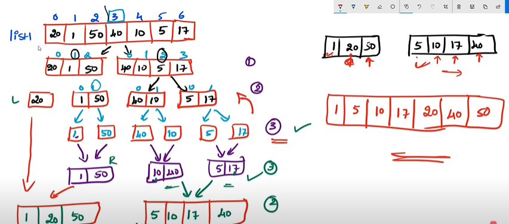

### Selection sort Algorithm
> Were going to be sorting this list in ascending order using selection sort algorithm 

```bash
index:0    1     2    3   4   5
      ---------------------------
      5    15    3    12   17  0 
      ---------------------------
```
1. search the list and find out the minmum value
- 1.1 using min() method
- 1.2 assume the first index is the least value 

> 1.2 After assuming first index is the least value and traversing through the list, we find out the actual minimum value in the list i.e 0
```bash
min-value:5
15 < 5   ❌   
      ---------------------------
      5    15    3    12   17  0 
      ---------------------------

3 < 5    ✅   
min-value:3
      ---------------------------
      5    15    3    12   17  0 
      ---------------------------

12 < 3 ❌
      ---------------------------
      5    15    3    12   17  0 
      ---------------------------

17 < 3 ❌
      ---------------------------
      5    15    3    12   17  0 
      ---------------------------

0 < 3  ✅
min-value:0
      ---------------------------
      5    15    3    12   17  0 
      ---------------------------
```
2. Swap the smallest number to 0'th index 
```bash 
      ---------------------------
       0    15    3    12   17  5 
      ---------------------------

sorted part- contains the first index (right now)
unsorted part- contains the unsorted list 
```
3. Now were going to follow the same procedure to sort the unsorted part of the list 

- first we find the min-value 
```bash 
assuming min-value:15
3 < 15   ✅
min-value:3
      -----------------------
       15    3    12   17  5 
      -----------------------
12 < 3   ❌
17 < 3   ❌
5  < 3   ❌
```
- then we swap the min-value with the first index
```bash 
      -----------------------
       3    15    12   17  5 
      -----------------------
```
4. Now this is the list 
```bash 
      -------------------------
      0   3    15    12   17  5 
      --------------------------

sorted part: 0, 3
unsorted part: 15, 12, 17, 5
```
5. find the minimum value and swap it with the first index 
```bash 
assume min-value: 15
12 < 15   ✅
min-value:12
    ----------------
    15    12   17  5 
    ----------------
17 < 12   ❌

5  < 12   ✅
min-value: 5
    ----------------
    5   15   12   17 
    ----------------
```
6. Now th sorted part of the list 
```bash 
      -------------------------
      0   3    5  15    12   17 
      --------------------------

sorted part: 0, 3, 5
unsorted part: 15, 12, 17
```
### Bubble sort Algorithm 
1. compare index 0'th element with next element, 
```bash 
if 0th element is greater than next element 
0th element < next element  ❌      swap 

if 0th element is less than next element 
0th element < next element   ✅  check for next element
```
> after 1st iteration we get the largest value at last position
```bash 
current-value:10 (0th index)
10<15   ✅
------------------
10  15  4   23   0 
------------------

check for next value 
current-value:15 (1st index)
15<4    ❌
------------------
10  15  4   23   0 
------------------

swap
------------------
10  4   15  23   0 
------------------

check for next value 
current-value:15 (2nd index)
15<23  ✅
------------------
10  4   15  23   0 
------------------

check for next value 
current-value: 23 (3rd index)
23<0   ❌
------------------
10  4   15  23   0 
------------------

swap
------------------
10  4   15  0   23 
------------------
```
> we'll follow the same steps for the second iteration, you'll notice that the second largets element will be assigned to the second last position of the list 
```bash 
cuurent-value:10 (0th index)
10<4   ❌
------------------
10  4   15  0   23 
------------------

swap 
------------------
4  10   15  0   23 
------------------

current-value:10 (1st index)
10<15  ✅
------------------
4  10   15  0   23 
------------------

current-value:15 (2nd index)
15<0   ❌
------------------
4  10   15  0   23 
------------------

swap 
------------------
4  10   0   15  23 
------------------

current-value:15 (3rd index)
15<23  ✅
```
> using the same approach we'll sort the entire list

### Merge sort Algorithm (divide and conquer algorithm)
to sort the list, we divide the list, then you need to merge the divided list 

1. find middle element of list1, to divide into 2 parts
```bash 
index: 0   1  2   3   4   5  6
list1: 20  1  50  40  10  5  17

length of list1: 7
middle element: 7//2 = 3
```

2. we extract sublists based on middle element 
```bash 
sublist1:
index: 0   1  2
list1: 20  1  50

sublist2:
index: 3   4   5   6
list1: 40  10  5   17
```

3. Again these sublist are dividied on basis of their middle element 
```bash 
sublist1:
index: 0   1  2
list1: 20  1  50

middle element= 3//2 = 1
(middle element is included in the right sublist)

sublist 1.1:
index: 0   
list1: 20  

sublist 1.2
index: 1  2
list1: 1  50

sublist2:
index: 0   1   2   3
list1: 40  10  5   17

middle element= 4//2=2

sublist 2.1:
index: 0   1
list1: 40  10 

sublist 2.2:
index: 0   1
list1: 5   17
```
4. now, were going to further divide until each sublist contains 1 element each
- and then we merge both the right and left list in ascending order on the third level, then proceed to 2nd level, and finally the 1st level



